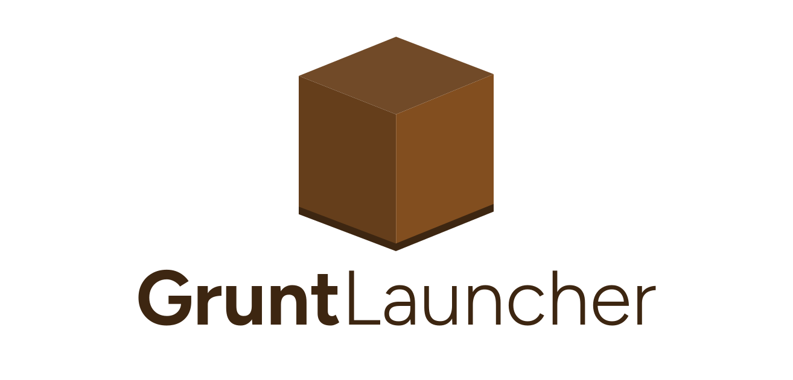

<h1 align="center">
  <picture>
    <source height="125" media="(prefers-color-scheme: dark)" srcset="banner-dark.svg">
    
  </picture>
</h1>

<p align="center">
  <em><b>GruntLauncher</b> is a cross-platform desktop launcher for <a href="https://www.vintagestory.at">Vintage Story</a></em>
</p>

<p align="center">
  <a href="https://github.com/renarin-kholin/gruntlauncher/actions/workflows/ci.yaml"></a>
  <a href="#license"></a>
</p>

> **Status:** pre-release / actively developed. Expect rough edges and breaking changes to on-disk data between `0.x` releases.

GruntLauncher manages multiple Vintage Story game versions and instances side by side, so you can keep separate mod setups for different worlds or versions without them stepping on each other which is similar in spirit to launchers like Prism/MultiMC for Minecraft.

## Preview


## Features
- [x] **Multiple instances**: create and manage several independent Vintage Story setups, each with its own game version and mod list.
- [x] **Version management**: download and install any released game version; already-downloaded versions are reused instead of re-fetched.
- [x] **Mod browsing**: search and browse mods from [ModDB](https://mods.vintagestory.at), with releases flagged for compatibility against the instance's selected game version.
- [x] **One-step install**: selected mods are downloaded and installed alongside the game version when an instance is created.
- [x] **Launch from the launcher**: start an instance directly, with its own data and mods directory.
- [x] **Accounts**: Login using your vintage story game account and use it with any instance without having to login every time.
- [x] **Manage Settings**: Edit the global settings.
- [x] **Manage Instances**: Edit the details of your instances.
- [ ] **Modpacks**: Create and share modpacks with ease for singleplayer worlds.

## Platform support

| Platform | Status |
|---|---|
| Linux | Supported |
| Windows | Supported (installs via the official silent installer) |
| macOS | Not yet supported (Looking for testers, I do not own a mac so I haven't been able to test it) |

## Installation

Grab the latest build from the [releases page](https://github.com/renarin-kholin/gruntlauncher/releases/latest):

| Platform | Recommended | Portable |
|---|---|---|
| Windows | [`GruntLauncher-win-Setup.exe`](https://github.com/renarin-kholin/gruntlauncher/releases/latest/download/GruntLauncher-win-Setup.exe) (auto-updates) | `GruntLauncher-win-Portable.zip` |
| Linux | [`GruntLauncher.AppImage`](https://github.com/renarin-kholin/gruntlauncher/releases/latest/download/GruntLauncher.AppImage) (auto-updates) | `gruntlauncher-x86_64-unknown-linux-gnu.tar.xz` |

On Linux, make the AppImage executable (`chmod +x GruntLauncher.AppImage`) and run it. Distro packages are planned.

> **Note:** if you use AppImageLauncher, prefer "Run once" over integration. AppImageLauncher moves the AppImage to a different location, which prevents the built-in updater from updating the copy you actually launch.

## Building from source
### Prerequisites

- [Rust](https://rustup.rs) (stable toolchain, 2024 edition)
- On Linux: `mold`, `clang`, `pkg-config`, and `libfontconfig1-dev` (or your distro's equivalents)

### Build

```sh
git clone https://github.com/renarin-kholin/gruntlauncher.git
cd gruntlauncher
cargo build --release
```

The binary is written to `target/release/gruntlauncher`.

### Run in development

```sh
cargo run
```

## Data locations

GruntLauncher stores config, cached data, and installed game/mod files in the OS-standard application directories (via the [`directories`](https://docs.rs/directories) crate), for example `~/.config/gruntlauncher`, `~/.cache/gruntlauncher`, and `~/.local/share/gruntlauncher` on Linux.

## Contributing

Contributions are welcome. Just create a PR or an issue.
## License

Licensed under either of

- Apache License, Version 2.0 ([LICENSE-APACHE](LICENSE-APACHE))
- MIT license ([LICENSE-MIT](LICENSE-MIT))

at your option.

## Acknowledgments

GruntLauncher's UI is built with [iced](https://iced.rs), a cross-platform GUI library for Rust.

## Disclaimer

GruntLauncher is an independent, unofficial project and is not affiliated with or endorsed by Anego Studios, the developers of Vintage Story.
